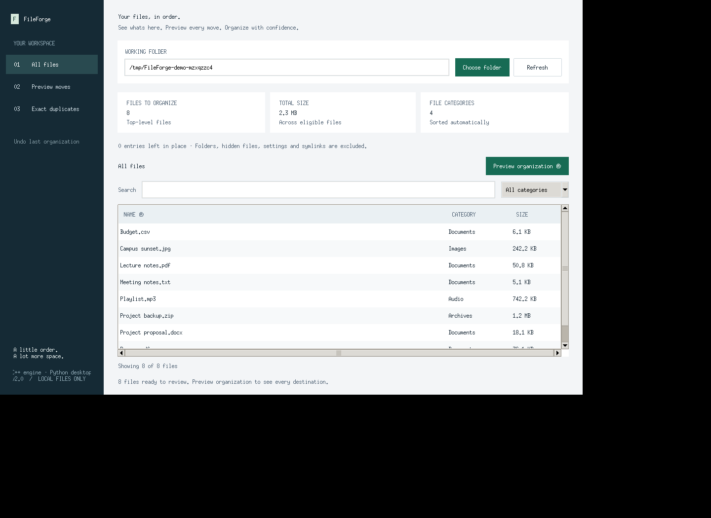

# FileForge

A desktop workspace for understanding and organizing a folder. A **Python/Tkinter interface** uses a **C++17 engine** for scanning, exact duplicate detection, previewed file moves, and recoverable undo. The original command-line interface remains available.



## Run

You need **Python 3.10+ with Tkinter** and a **C++17 compiler**. There are no pip dependencies for the app.

**Windows:** install Python and a MinGW-w64 compiler (for example through MSYS2), ensure `python` and `g++` are on PATH, then double-click `run.bat`.

Manual Windows commands:

```bat
g++ -std=c++17 -O2 -municode fileforge.cpp -o fileforge.exe
python fileforge_desktop.py
```

The `-municode` flag is required by the Windows Unicode entry point.

**Linux/macOS:** run `sh run.sh`, or:

```sh
g++ -std=c++17 -O2 fileforge.cpp -o fileforge
python3 fileforge_desktop.py
```

On Linux, install your distribution's Tkinter package if `python3 -m tkinter` cannot open a window (commonly `python3-tk`). Run the compiled engine directly to use the interactive CLI.

## Two-minute demo

1. Make a disposable folder with a few documents, images, and two identical copies of a text file.
2. Choose that folder in FileForge. Search, filter by category, and click column headings to sort.
3. Open **Preview** to inspect exact destination names, including collision suffixes. Nothing moves at this stage.
4. Confirm **Organize**. Use **Undo** to restore the files.
5. Open **Duplicates** to inspect exact matching groups. Duplicate detection only reports; it never deletes files.

## What it does

- A clear folder summary, searchable/sortable file table, category filters, and empty/error states.
- Preview destinations in Images, Documents, Videos, Audio, Archives, Code, and Other.
- A folder snapshot prevents organizing from a stale preview.
- Background work keeps the window responsive and prevents duplicate submissions.
- Exact duplicates are grouped by size and then compared byte for byte.
- Collision-safe organize and undo: existing destination files are never overwritten.
- A local write-ahead recovery journal records planned moves before files change.
- Partial undo keeps unresolved entries for retry rather than throwing away the recovery record.
- Ctrl+O chooses a folder, Ctrl+R refreshes, Ctrl+F focuses search, and Escape clears the search.

## Boundaries and recovery

Only **top-level regular files** are considered. Subfolders, symbolic links, dotfiles, common configuration extensions, and FileForge's engine/desktop files are skipped. Windows hidden/system attributes are also honored. The UI reports excluded entries. Organization applies to all eligible files in the folder, not just the current search results.

Keep `.fileforge_undo.log` until undo is complete. A new organization is blocked while a recovery record exists. Files edited or removed after organization may remain pending; restore the unchanged organized file to its recorded location and retry Undo, or recover it manually. Empty category folders are retained. Do not modify the journal.

**Upgrading from the older CLI:** version-1 undo logs are intentionally rejected, not deleted. Undo any outstanding organization with your old executable before upgrading. Keep the old executable/log if manual recovery is needed.

The journal helps with interrupted normal operations, but this is not a power-loss-safe transactional filesystem or a security boundary for folders being modified by hostile concurrent processes. Preview first and use ordinary backups for important files. Large same-size file collections can take time to compare.

## Code map

| File | Responsibility |
|---|---|
| `fileforge.cpp` | Scanning, JSON/CLI protocol, safe moves, recovery journal, duplicates |
| `fileforge_desktop.py` | Tkinter layout, subprocess client, worker queue, user interactions |
| `test_engine.py` | Filesystem behavior and safety regressions |
| `test_desktop.py` | Real client/worker tests and Tk interactions |
| `test_fileforge.py` | Original CLI regression tests |

The UI passes argument lists directly to the engine without a shell. Its JSON interface is also usable independently:

```sh
./fileforge --json scan /path/to/folder
./fileforge --json preview /path/to/folder
./fileforge --json duplicates /path/to/folder
```

Organization additionally requires the `--snapshot` token returned by preview. `./fileforge --help` lists commands.

## Tests

Compile the engine as above, then run `python -m unittest discover -v`.
GUI tests need a display; on Linux use `xvfb-run -a python -m unittest discover -v`. They cover scan/search/sort, preview cancellation, organize/undo, duplicates, error recovery, and worker behavior. Windows-only file-attribute tests skip on other operating systems; symlink checks run on Linux because Windows symlink permissions vary.
